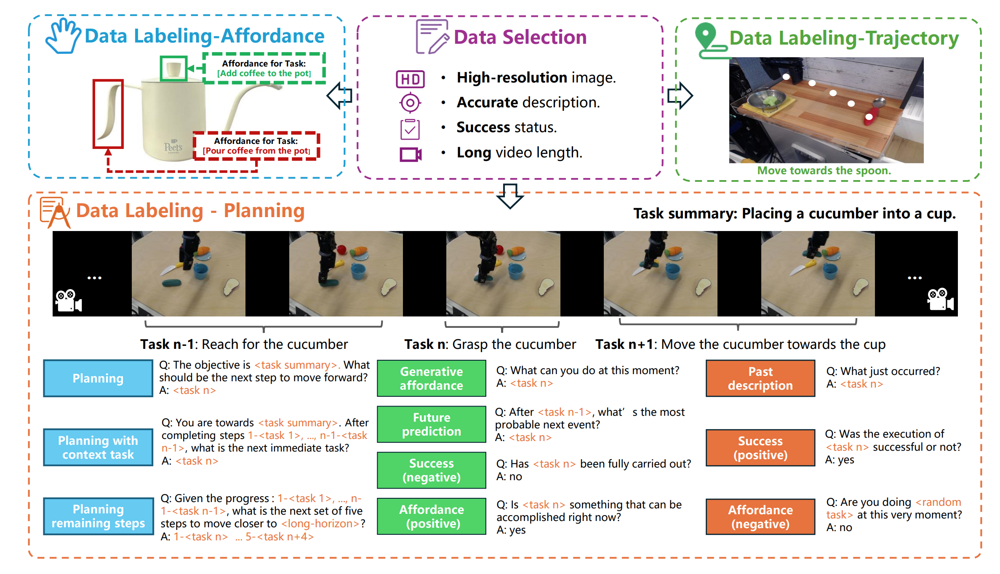
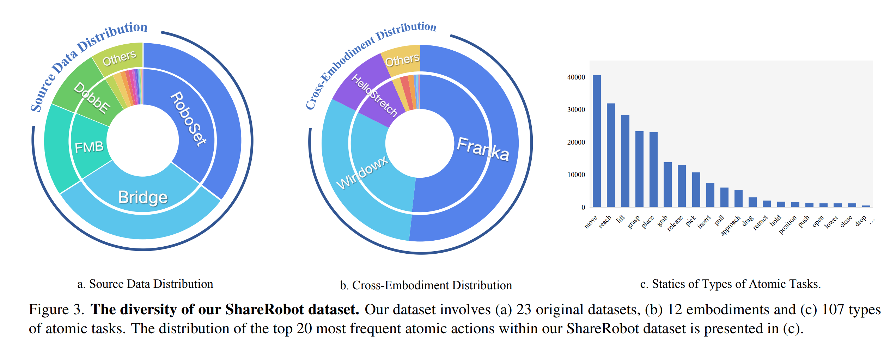
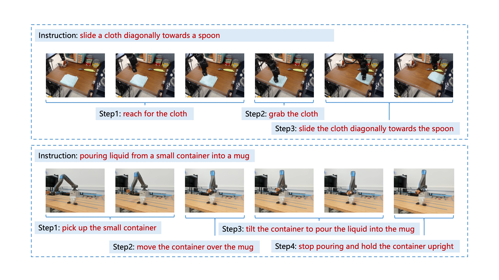
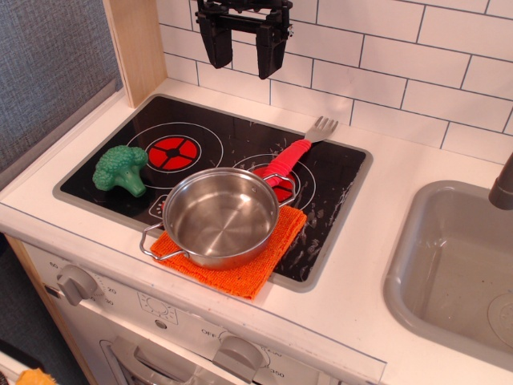
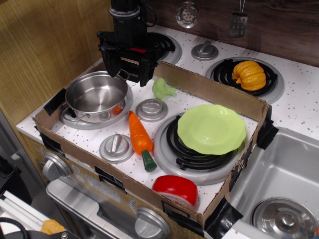
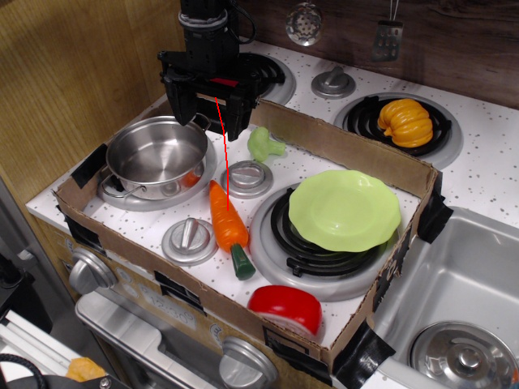

# ShareRobot Dataset

**ShareRobot**, a high-quality heterogeneous dataset that labels multi-dimensional information, including task planning, object affordance, and end-effector trajectory, effectively enhancing various robotic capabilities.


## Overview of ShareRobot



For **planning**, we have 51,403 episodes and each with 30 frames. In the process of data generation, we design 5 different templates for each of the 10 question types in RoboVQA [1]. In the process of data generation, we randomly select 2 templates of each question type to generate question-answer pairs for every instance. This process transforms 51,403 instances into 1,027,990 question-answer pairs, with annotators monitoring data generation to maintain the dataset’s integrity.

For **Affordance**, we have 6,522 images and each with affordance areas aligned with an instruction. 

For **Trajectory**, we have 6,870 images and each with at least 3 {x, y} coordinates aligned with an instruction.


## Data Sources



**ShareRobot** dataset contains 23 original datasets from Open X-Embodiment dataset [2], 12 embodiments and 107 types of atomic tasks. 


### Raw Dataset for Planning

| Raw Dataset                                                   | Number of Raws |
|:-------------------------------------------------------------:| --------------:|
| nyu_door_opening_surprising_effectiveness                     | 421            |
| bridge                                                        | 15738          |
| dlr_edan_shared_control_converted_externally_to_rlds          | 63             |
| utokyo_xarm_pick_and_place_converted_externally_to_rlds       | 92             |
| cmu_stretch                                                   | 10             |
| asu_table_top_converted_externally_to_rlds                    | 109            |
| dlr_sara_pour_converted_externally_to_rlds                    | 51             |
| utokyo_xarm_bimanual_converted_externally_to_rlds             | 27             |
| robo_set                                                      | 18164          |
| dobbe                                                         | 5200           |
| berkeley_autolab_ur5                                          | 882            |
| qut_dexterous_manpulation                                     | 192            |
| aloha_mobile                                                  | 264            |
| dlr_sara_grid_clamp_converted_externally_to_rlds              | 40             |
| ucsd_pick_and_place_dataset_converted_externally_to_rlds      | 569            |
| ucsd_kitchen_dataset_converted_externally_to_rlds             | 39             |
| jaco_play                                                     | 956            |
| utokyo_pr2_opening_fridge_converted_externally_to_rlds        | 64             |
| conq_hose_manipulation                                        | 56             |
| fmb                                                           | 7836           |
| plex_robosuite                                                | 398            |
| utokyo_pr2_tabletop_manipulation_converted_externally_to_rlds | 189            |
| viola                                                         | 44             |


### Raw Dataset for Affordance

| Raw Dataset                                                   | Number of Raws |
| ------------------------------------------------------------- | -------------- |
| utokyo_pr2_tabletop_manipulation_converted_externally_to_rlds | 24             |
| utokyo_xarm_pick_and_place_converted_externally_to_rlds       | 23             |
| ucsd_kitchen_dataset_converted_externally_to_rlds             | 10             |
| ucsd_pick_and_place_dataset_converted_externally_to_rlds      | 112            |
| nyu_door_opening_surprising_effectiveness                     | 85             |
| jaco_play                                                     | 171            |
| bridge                                                        | 2610           |
| utokyo_pr2_opening_fridge_converted_externally_to_rlds        | 12             |
| asu_table_top_converted_externally_to_rlds                    | 24             |
| viola                                                         | 1              |
| berkeley_autolab_ur5                                          | 122            |
| aloha_mobile                                                  | 23             |
| conq_hose_manipulation                                        | 1              |
| dobbe                                                         | 717            |
| fmb                                                           | 561            |
| plex_robosuite                                                | 13             |
| qut_dexterous_manpulation                                     | 16             |
| robo_set                                                      | 1979           |
| dlr_edan_shared_control_converted_externally_to_rlds          | 18             |
| **Summary**                                                   | 6522           |


### Raw Dataset for Trajectory

| Raw Dataset                                                   | Number of Raws |
| ------------------------------------------------------------- | -------------- |
| utokyo_pr2_tabletop_manipulation_converted_externally_to_rlds | 35             |
| utokyo_xarm_pick_and_place_converted_externally_to_rlds       | 36             |
| ucsd_kitchen_dataset_converted_externally_to_rlds             | 19             |
| dlr_sara_grid_clamp_converted_externally_to_rlds              | 1              |
| ucsd_pick_and_place_dataset_converted_externally_to_rlds      | 109            |
| nyu_door_opening_surprising_effectiveness                     | 74             |
| jaco_play                                                     | 175            |
| utokyo_xarm_bimanual_converted_externally_to_rlds             | 7              |
| bridge                                                        | 2986           |
| utokyo_pr2_opening_fridge_converted_externally_to_rlds        | 12             |
| asu_table_top_converted_externally_to_rlds                    | 22             |
| berkeley_autolab_ur5                                          | 164            |
| dobbe                                                         | 759            |
| fmb                                                           | 48             |
| qut_dexterous_manpulation                                     | 29             |
| robo_set                                                      | 2374           |
| dlr_sara_pour_converted_externally_to_rlds                    | 3              |
| dlr_edan_shared_control_converted_externally_to_rlds          | 17             |
| **Summary**                                                   | 6870           |


## Data Format

### Planning



```json
{
 "id"{
        "id": "/mnt/hpfs/baaiei/jyShi/rt_frames_success/rtx_frames_success_42/62_robo_set#episode_1570",
        "task": "Future_Prediction_Task",
        "selected_step": 3,
        "conversations": [
            {
                "from": "human",
                "value": "<image 0-25> After <move the grasped banana towards the mug>, what's the most probable next event?"
            },
            {
                "from": "gpt",
                "value": "<place the banana into the mug>"
            }
        ],
        "image": [
            "/path/to/image_0-25"
        ]
    }        
}
```

     


### Affordance

<!---->
<div style="display: flex; gap: 10px;">
  
  
</div>

```json
{

        "id": 2486,
        "meta_data": {
            "original_dataset": "bridge",
            "original_width": 640,
            "original_height": 480
        },
        "instruction": "place the red fork to the left of the left burner",
        "affordance": {
            "x": 352.87425387858815,
            "y": 186.47871614766484,
            "width": 19.296008229513156,
            "height": 14.472006172134865
    }
```


#### Visualize Code

```python
import json
import os
import cv2
import numpy as np

img_dir = '/path/to/your/original/images/dir'
affordance_json = '/path/to/your/affordances/json'
output_img_dir = '/path/to/your/visualized/images/dir'

with open(affordance_json, 'r') as f:
    data = json.load(f)
    for item in data:
        filepath = os.path.join(img_dir, item['id'])

        image = cv2.imread(filepath)
        color = (255, 0, 0)
        thickness = 2

        x_min,y_min = item['affordance']['x'], item['affordance']['y']
        x_max,y_max = item['affordance']['x']+item['affordance']['width'], item['affordance']['y']+item['affordance']['height']

        # 定义矩形的四个顶点坐标
        pts = np.array([
            [x_min, y_min],  # 左上角
            [x_max, y_min],  # 右上角
            [x_max, y_max],  # 右下角
            [x_min, y_max]   # 左下角
        ], dtype=np.float32)

        # 绘制矩形框
        cv2.polylines(image, [pts.astype(int)], isClosed=True, color=color, thickness=thickness)

        # 获取相对路径并拼接目标路径
        relative_path = os.path.relpath(filepath, img_dir)  # 获取相对于 img_dir 的相对路径
        output_img_path = os.path.join(output_img_dir, relative_path)  # 拼接目标路径

        # 创建目标文件夹
        output_directory = os.path.dirname(output_img_path)
        if not os.path.exists(output_directory):
            os.makedirs(output_directory)

        # 打印调试信息
        print(f"Input filepath: {filepath}")
        print(f"Output image path: {output_img_path}")
        print(f"Output directory: {output_directory}")

        # 保存图像
        cv2.imwrite(output_img_path, image)

```


### Trajectory

<!-- -->
<div style="display: flex; gap: 10px;">
  
  
</div>

```json
{
        "id": 456,
        "meta_data": {
            "original_dataset": "bridge",
            "original_width": 640,
            "original_height": 480
        },
        "instruction": "reach for the carrot",
        "points": [
            [
                265.45454545454544,
                120.0
            ],
            [
                275.1515151515152,
                162.42424242424244
            ],
            [
                280.0,
                213.33333333333331
            ],
            [
                280.0,
                259.3939393939394
            ]
        ]
    },
```

#### Visualize Code

```python
import json
import os
from PIL import Image, ImageDraw

trajectory_final = '/path/to/your/trajectory_json'
img_dir = '/path/to/your/original/images/dir'
output_img_dir = '/path/to/your/visualzed/images/dir'

with open(trajectory_final, 'r') as f:
    data = json.load(f)
    for item in data:
        filepath = os.path.join(img_dir, item['id'])
        points = item['points']

        image = Image.open(filepath).convert("RGB")  # 确保图像是 RGB 模式
        draw = ImageDraw.Draw(image)  # 创建绘图对象
        # 定义颜色和线宽
        color = (255, 0, 0)  # 红色 (RGB 格式)
        thickness = 2


        scaled_points = [
                (point[0], point[1])
                for point in points
            ]
        # 按照顺序连接相邻的点
        for i in range(len(scaled_points) - 1):
            draw.line([scaled_points[i], scaled_points[i + 1]], fill=color, width=thickness)

        # 获取相对路径并拼接目标路径
        relative_path = os.path.relpath(filepath, img_dir)
        output_img_path = os.path.join(output_img_dir, relative_path)

        # 创建目标文件夹
        output_directory = os.path.dirname(output_img_path)
        if not os.path.exists(output_directory):
            os.makedirs(output_directory)

        # 打印调试信息
        print(f"Input filepath: {filepath}")
        print(f"Output image path: {output_img_path}")
        print(f"Output directory: {output_directory}")

        # 保存图像
        image.save(output_img_path)
```


## Evaluation


## Reference

[1] Pierre Sermanet, Tianli Ding, Jeffrey Zhao, Fei Xia, Debidatta Dwibedi, Keerthana Gopalakrishnan, Christine Chan,Gabriel Dulac-Arnold, Sharath Maddineni, Nikhil J Joshi,et al. Robovqa: Multimodal long-horizon reasoning forrobotics. In ICRA, pages 645–652, 2024.

[2] Abby O’Neill, Abdul Rehman, Abhinav Gupta, AbhiramMaddukuri, Abhishek Gupta, Abhishek Padalkar, AbrahamLee, Acorn Pooley, Agrim Gupta, Ajay Mandlekar, et al.Open x-embodiment: Robotic learning datasets and rt-xmodels. arXiv preprint arXiv:2310.08864, 2023.


## Citation
```
@article{ji2025robobrain,
  title={RoboBrain: A Unified Brain Model for Robotic Manipulation from Abstract to Concrete},
  author={Ji, Yuheng and Tan, Huajie and Shi, Jiayu and Hao, Xiaoshuai and Zhang, Yuan and Zhang, Hengyuan and Wang, Pengwei and Zhao, Mengdi and Mu, Yao and An, Pengju and others},
  journal={arXiv preprint arXiv:2502.21257},
  year={2025}
}
```
